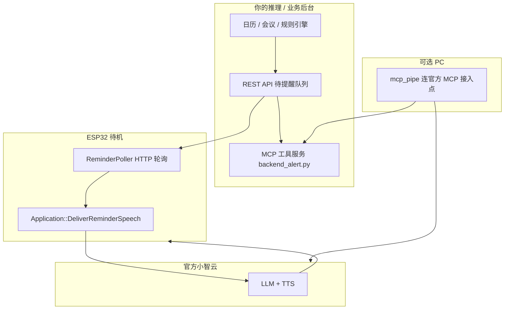

# 会议提醒方案：MCP 推理服务 + 固件轮询 + 官方小智 TTS

## 1. 目标

- **推理侧（PC/服务器）**：自写 MCP 服务 + 可选 `mcp_pipe`，轮询日历/会议/业务 API，维护「待提醒队列」。
- **设备侧（ESP32 待机）**：定时 HTTP 轮询同一推理 API，发现新提醒后 **自动开官方会话并 TTS 播报**（如「10 分钟后产品会议」）。
- **云端**：仅使用官方小智云的 **MQTT + UDP + listen/detect + TTS**，不依赖私有 `notify`。

---

## 2. 总体架构



| 通道 | 何时工作 | 作用 |
|------|----------|------|
| **固件轮询** | 待机 `idle`，每 N 秒 | **主动播报**（本方案核心） |
| **MCP + mcp_pipe** | 用户已唤醒、在对话 | 查最新提醒、问答补充 |
| **GeneralTimer** | 本地到点 | 固定闹钟（可与 API 并存） |

---

## 3. REST API 约定（推理服务对外）

### 3.1 拉取待提醒

```http
GET /v1/devices/{device_id}/reminders/pending
```

`device_id` 使用设备 MAC（与 OTA `Device-Id` 一致），便于绑定用户。

**响应 200：**

```json
{
  "has_reminder": true,
  "id": "meet-20260603-1400",
  "speak": true,
  "emotion": "neutral",
  "title": "会议提醒",
  "prompt": "请用简洁口语提醒用户：10分钟后有产品评审会，请提前进入会议室。",
  "expires_at": 1748937600
}
```

无待提醒：

```json
{ "has_reminder": false }
```

| 字段 | 说明 |
|------|------|
| `id` | 全局唯一，设备用于去重 |
| `speak` | `true` 走 TTS（`DeliverReminderSpeech`）；`false` 仅 `Alert` UI+振动 |
| `prompt` | 发给官方的「伪用户意图」文案，LLM 据此生成口语回复 |
| `emotion` | 播报前小球表情 |

### 3.2 确认已播报（可选）

```http
POST /v1/devices/{device_id}/reminders/ack
Content-Type: application/json

{ "id": "meet-20260603-1400" }
```

推理服务从队列移除或标记已投递，避免重复播报。

### 3.3 MCP 与 API 共用队列

`tools/mcp-backend-demo/backend_alert.py` 轮询同一 API 写入内存，工具 `backend_get_latest_alert` 供对话查询；**与固件轮询同源**，避免两套数据不一致。

---

## 4. 固件行为（`ReminderPoller`）

1. `menuconfig` 打开 `CONFIG_USE_REMINDER_POLL`，设置轮询间隔（默认 30s）。
2. NVS `reminder_poll`：
   - `poll_url`：如 `http://192.168.1.10:8765/v1/devices/{device_id}/reminders/pending`
   - `ack_url`：可选，默认同 host 的 `.../reminders/ack`
   - `last_id`：上次已播报 id
3. 独立 FreeRTOS 任务：间隔到期 → HTTP GET → 解析 JSON。
4. 仅当 `device_state == idle` 且 `has_reminder && id != last_id` 时，在主线程调用 `DeliverReminderSpeech(prompt, emotion)`。
5. `DeliverReminderSpeech`：更新 UI → `OpenAudioChannel` → `SendWakeWordDetected(prompt)` → 官方 TTS → 播报结束回 `idle`。
6. 成功后写 `last_id`，可选 POST ack。

**不播报的情况：** 配网中、升级中、闹钟响铃、正在对话/播报中（可排队或跳过，当前实现为跳过）。

---

## 5. MCP 推理服务（PC）

```bash
# 1. 启动模拟推理 API（含会议队列）
cd tools/inference-api-demo
pip install -r requirements.txt
python server.py

# 2. 启动 MCP（轮询同一 API）
cd tools/mcp-backend-demo
set INFERENCE_API_BASE=http://127.0.0.1:8765
set INFERENCE_DEVICE_ID=aa:bb:cc:dd:ee:ff
pip install -r requirements.txt
cd tools\mcp-calculator
set MCP_ENDPOINT=wss://你的接入点
python mcp_pipe.py backend_alert.py
```

用户唤醒后问：「有什么会议要提醒我吗？」→ LLM 调 MCP → 读到与固件相同的后台数据。

---

## 6. 会议提醒数据流示例

| 时间 | 推理服务 | 固件 |
|------|----------|------|
| T-15min | 日历同步，写入队列 `meet-xxx`，prompt 含会议主题/时间 | 轮询 `has_reminder:false` |
| T-10min | 同上 | 轮询命中 → TTS「十分钟后产品评审会…」→ ack |
| T+0 | 队列已 ack | 轮询 `has_reminder:false` |
| 用户唤醒 | MCP 工具返回「刚才已提醒过」或下一条 | 对话补充 |

---

## 7. 配置清单

| 位置 | 项 |
|------|-----|
| `idf.py menuconfig` | `XVSENFENG_ALARM` → `启用提醒轮询` |
| NVS `reminder_poll` | `poll_url`, `ack_url`, `last_id` |
| 推理服务 | 会议 API、队列、ack |
| 小智云 | 常规定价 MQTT/激活，无需 notify |

---

## 8. 风险与建议

| 风险 | 缓解 |
|------|------|
| 耗电 | 默认 30s 轮询，电池设备可在 menuconfig 加大间隔；Wi-Fi 省电模式权衡 |
| 重复播报 | `id` + NVS `last_id` + 服务端 ack |
| prompt 被 LLM 改写 | prompt 写清「原文复述」；或会议类用固定模板 |
| 与用户对话冲突 | 仅 `idle` 触发；忙时跳过 |
| HTTPS | 正式环境用 TLS；开发可用局域网 HTTP |

---

## 9. 相关文件

| 路径 | 说明 |
|------|------|
| `main/reminder/reminder_poller.cc` | 固件轮询 |
| `main/application.cc` | `DeliverReminderSpeech` |
| `tools/inference-api-demo/server.py` | 本地推理 API Demo |
| `tools/mcp-backend-demo/backend_alert.py` | MCP + 轮询 |
| `docs/proactive-reminder-official-cloud.md` | 官方云能力边界 |
| `docs/standby-reminder-deployment.md` | **完整部署指南（mcp-calculator + 固件）** |
